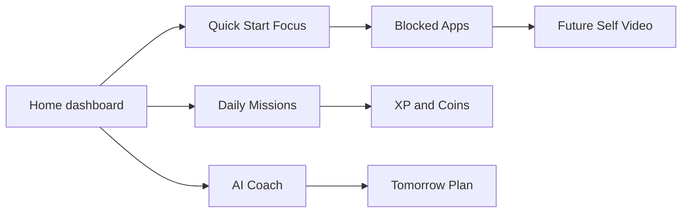

# Forge Product Strategy

## UX Research

Forge targets people who already understand that discipline matters but fail when tools rely on shame, rigid blocking, or manual tracking. Interviews should focus on three moments: the planning moment, the temptation moment, and the recovery moment after a failed day.

Core hypotheses:

- Users stay subscribed when progress feels visible, personal, and socially reinforced.
- Adaptive unlocks outperform absolute blocking because they preserve agency.
- AI coaching is trusted when it explains small schedule changes using the user's own data.
- Future Self videos create emotional friction without guilt.

Research methods:

- 12 diary studies across students, professionals, creators, and founders.
- 20 usability sessions for onboarding, focus start, app unlock, and daily review.
- A/B tests for reward language, coin costs, mission difficulty, and notification tone.
- Longitudinal cohort study measuring week four retention, focus minutes, and goal progress.

## Personas

### Arya, Exam Candidate

- Needs structure for JEE preparation, sleep consistency, and app restraint.
- Loves visible streaks, community study rooms, and milestone rewards.
- Churn risk: plans feel too ambitious or punitive.

### Maya, Product Designer

- Needs deep work, recovery, creative energy, and fewer context switches.
- Loves focus music, trend analytics, and calm coaching.
- Churn risk: analytics feel generic.

### Dev, Founder

- Needs high leverage work blocks, health routines, and team accountability.
- Loves predictive planning and cross-device blocking.
- Churn risk: setup takes too long.

## Competitive Analysis

| Product | Strength | Gap Forge Exploits |
| --- | --- | --- |
| Forest | Simple focus reward | Not a full growth system |
| Freedom | Strong blocking | Low emotional attachment |
| Notion | Flexible planning | No behavioral enforcement |
| Duolingo | Habit loops | Not built for personal goals |
| Headspace | Calm guidance | Limited productivity intelligence |
| Apple Fitness | Progress motivation | Narrow health scope |

Forge's advantage is the blend of emotional motivation, adaptive constraints, personalized AI, and real-life RPG progression.

## Information Architecture

- Home: daily plan, progress, next task, level, streak, mood, sleep, discipline score.
- Onboarding: conversational profile capture and generated plan.
- Focus: timer, app rules, strict mode, emergency unlock, breaks, session analytics.
- Goals: life goals, milestones, habits, tasks, routines.
- RPG: stats, XP, badges, titles, seasons, missions, quests.
- Coach: insights, daily review, tomorrow plan, burnout detection.
- Intelligence: scores, trends, Habit DNA, predictions.
- Community: guilds, study rooms, challenges, leaderboards.
- Friends: shared sessions, challenges, streak celebrations.
- Marketplace: creator templates, plans, roadmaps, purchase history.
- Admin: users, plans, moderation, marketplace review, revenue, health metrics.

## User Flows

### Onboarding to Plan

1. User answers one conversational question at a time.
2. Forge infers primary growth archetype.
3. AI proposes daily routine, focus schedule, habits, blocking rules, rewards, and milestones.
4. User accepts or edits the first week.
5. Forge starts the first focus session.

### Temptation Moment

1. User opens a distracting app during focus time.
2. Forge checks strict mode, emergency contacts, coins, and required missions.
3. If locked, Forge shows Future Self video or coach message.
4. User can return to focus, take a scheduled break, or use emergency unlock.
5. Event is logged for analytics and coach recommendations.

### Daily Review

1. Forge summarizes wins, missed routines, mood, sleep, focus time, and app unlocks.
2. AI explains one pattern and recommends tomorrow's adjustment.
3. User selects tomorrow's main quest.
4. XP, streak, and level updates are awarded.

## Wireframes

## Design System

- Visual style: dark-first premium glass, restrained gradients, large spacing, dense information only where it improves scanning.
- Typography: Geist Sans for product UI, Geist Mono for technical or score-like labels.
- Radius: 20-38px for major surfaces, 999px for pills and timers.
- Color roles: mint for progress, gold for rewards, coral for urgency, blue for intelligence, rose for emotional moments.
- Motion: 160-220ms hover lift, 300-500ms progress transitions, no blocking animations.
- Accessibility: AA contrast targets, semantic labels, keyboard focus states, reduced-motion fallback.

## High-Fidelity UI

The implemented web surface in `app/page.tsx` contains the first high-fidelity product pass:

- First-viewport home dashboard.
- Conversational onboarding preview.
- Interactive focus duration selector and strict mode toggle.
- Adaptive app coin economy.
- RPG stats and daily missions.
- AI Coach and Future Self panels.
- Productivity intelligence and Habit DNA.
- Communities, marketplace framing, pricing, and production roadmap.

